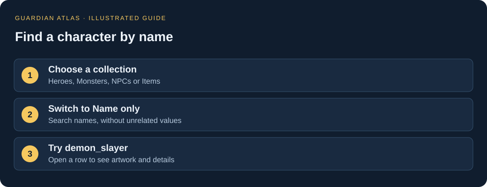
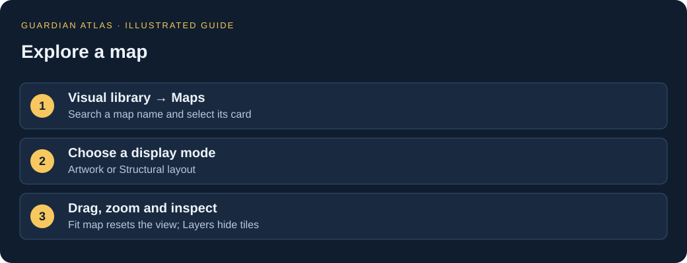
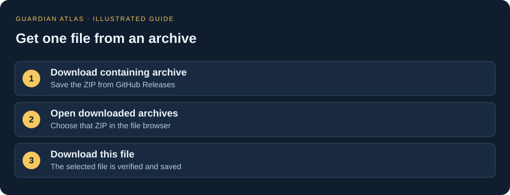

# Guardian Atlas

Explore Guardian Tales heroes, enemies, items, artwork, maps and recovered game data—without writing code or installing the game.

**[Open the website](https://Jikolr.github.io/guardian-explorer/) · [How to use: visual guide](https://Jikolr.github.io/guardian-explorer/help.html) · [Download archives](https://github.com/Jikolr/guardian-explorer/releases/tag/game-files-3.54.0-snapshot)**

## What would you like to do?

| I want to… | Start here |
| --- | --- |
| Find a character’s identity, variants and linked weapons | [Character directory](https://Jikolr.github.io/guardian-explorer/characters.html) |
| Compare up to four records | [Side-by-side comparison](https://Jikolr.github.io/guardian-explorer/compare.html) |
| Recognize a hero, boss or item | [Artwork & portraits](https://Jikolr.github.io/guardian-explorer/visual.html) |
| Look up stored stats or other details | [Data tables](https://Jikolr.github.io/guardian-explorer/index.html) |
| Explore a map | [Map library](https://Jikolr.github.io/guardian-explorer/visual.html?tab=maps) |
| Explore XP requirements | [XP calculator](https://Jikolr.github.io/guardian-explorer/research.html#xp) |
| Download a picture, table or original file | [Game files & downloads](https://Jikolr.github.io/guardian-explorer/files.html) |
| Read recovered scripts and research | [Research archive](https://Jikolr.github.io/guardian-explorer/research.html) |

## Find your first character

1. Open **Data tables** and choose **Heroes**, **Monsters** or **NPCs** in the sidebar. Use **Find a table…** to locate other collections, such as items.
2. Select **Name only** beside the search box. This avoids results that match unrelated values inside a record.
3. Search part of a name, then select a row to see its portrait and details.
4. Choose **Browse related artwork** to see the pictures linked to that entry.

**Try [Andras](https://Jikolr.github.io/guardian-explorer/visual.html?tab=heroes&q=Andras&scope=name): her internal name is `demon_slayer`.** In-game names and file names can differ; the directory labels confirmed names and English-spelling matches separately.

**Name only** still matches parts of names: `oni` can match `onigirl` or `moniko`. **All fields** searches every stored value, including nested details. Use it when you are researching something beyond a name.

## Character profiles, comparisons and saved discoveries

Open **Characters**, search an internal or known in-game name, and select a portrait. Profiles bring together evolution variants, linked weapons, battle actions and matched biographies. The directory has 222 character families (including non-playable/test entries); 45 names are linked, with evidence labels: 2 confirmed identities, 17 English-spelling matches and 26 biography-based inferences. The inferred matches are not independently confirmed. Biography matches are also labeled.

Choose **Compare** from a variant or a hero, monster, NPC or item record. Add up to four entries, then use the bottom **Compare** button. **Only differences** hides identical fields; highlighted values and numeric changes are relative to the first entry. You can download the comparison as JSON.

Use **☆ Save view**, **Save record** or **Save character** to keep a discovery in this browser. **Saved** opens your bookmarks; **Copy link** shares the current view, including supported filters, comparison choices or XP inputs. Favorites do not sync across devices, and clearing browser data removes them. Copy links from the hosted website for other visitors; localhost links work only on your own running local site.

## Browse pictures and maps

The visual library has tabs for **Heroes**, **Monsters & bosses**, **NPCs**, **Items** and **Maps**. **All graphics** also includes backgrounds, interface pictures and animation sheets.

- Select a hero card to open its character profile; other character and item cards open their data entries.
- Select a graphic card to view and download its image preview.
- A new name search that finds nothing in one section tries the other sections and explains when it switches.
- Pictures labeled **Texture / atlas** may contain separate body parts or animation pieces. Look for **Icon / sprite** when you want a recognizable portrait.

In a map, **drag to move**, **scroll or use +/− to zoom**, and choose **Fit map** to reset the view. Toggle **Layers** to hide objects, floors or walls. Click a tile—or choose it from the object list—to see its name and position.

Enable **Markers** to inspect decoded placements. Use **Find a placement** to search names and toggle NPCs, enemies, events, camera markers or other markers. Select a search result to zoom directly to it. Marker colors follow the stored layer, and each marker shows its stored name and position; these do not confirm live spawn identities or event behavior. Map links remember the view mode, layers and selected object, but reset the camera to fit.

Try [the small ancient dungeon](https://Jikolr.github.io/guardian-explorer/map-preview.html?map=ancientdungeon_red_1_1). Choose **Structural layout** if artwork is missing. The artwork count describes coverage, not loading progress. Maps are reconstructions: animations, live events and some decorations are not shown.

## Use the XP calculator

Choose **XP & progression** in the shared left sidebar. Choose **Hero** or **Weapon**, select a variant, and enter the starting and target internal levels. The result updates automatically; **Download this table** saves the selected data.

These are **internal level indices**, not verified in-game level labels. The calculator assumes no partial XP at the starting level. Platform variants, live changes and playable caps may differ.

## Download a picture, a record or a folder

For a quick download, look for:

- **Download image** / **Download image preview** in record or graphic details.
- **Download record JSON** in a selected record.
- **Download table JSON** above a data table.
- **Download map JSON** in the map viewer.

JSON is simply a text file containing organized names and values. You can save it without knowing how to read its formatting. Image previews can be smaller than the original game textures.

### Original and recovered files

The [file browser](https://Jikolr.github.io/guardian-explorer/files.html) separates **Decrypted / decoded files**, **Unencrypted originals**, **Encrypted originals**, **Other original binaries**, and **Website exports & images**.

1. Select a file and click **Download containing archive** to save its ZIP from GitHub Releases.
2. Return to the file browser and use **Open downloaded archives** to select that ZIP. It stays on your device; nothing is uploaded.
3. Select the file again and click **Download this file**. The website checks the file before saving it.

For a whole folder, click **Download folder…**. Download the listed ZIP parts, or open the required archives locally to save an exact small subfolder. Parts are independent ZIP files: extract the parts you want into the same directory. Folder downloads include subfolders and ignore your text search filter. Some packages also contain neighboring folders.

**Website exports download directly**, without first opening an archive. Large export folders are offered in ZIP parts. Original bundles may require specialist software to open even when they are unencrypted.

## Common questions

**Why can’t I find a character’s in-game name?**

Only some aliases are mapped. Try part of an internal name, clear filters, or browse the portraits.

**Why are there several versions of the same character?**

Different evolution ranks, regional variants and game modes can have separate entries. The number of records is not the number of unique heroes.

**Are these the final stats I will see in the game?**

No. These are stored values from an offline snapshot. Equipment, buffs, runtime changes and server behavior can affect the final result. The source folder and inspected APK may differ in region or version.

**Why is “Download this file” disabled?**

Download the containing archive first, then open that ZIP in the file browser. Direct website exports do not require this step.

**Why is loading slow?**

The catalogs and maps can be large. Wait for the loading message to finish before searching, especially on a first visit. If a page reports an error, check your connection and reload.

## What is available?

- 130 searchable data collections.
- 29,078 available graphic previews, with images linked to hundreds of hero records and thousands of monster, NPC and item entries.
- 2,027 interactive parsed maps; unsupported entries are labeled.
- 6,344 recovered Lua scripts and a research area for code indexes, events and extraction evidence.
- 39 downloadable game-file archives, separate from the website repository.

This is an unofficial offline archive, not a live game database. Local account settings and analytics are excluded. “Unencrypted” describes a file format; it does not mean public domain.

---

**Maintaining or running the site yourself?** See [maintainer notes](docs/MAINTAINING.md) for local setup, rebuilding and GitHub Pages deployment. Regular visitors only need the website link above.

## Read the code behind a rule

Every page now has the same left sidebar. On smaller screens, use **All sections** to open it.

- **Damage calculation** opens the explained formula and links to its supporting instructions.
- **Reports & evidence** contains analysis reports, recovered assembly excerpts, extraction-tool source and audit inventories. Each file can be downloaded.
- **Compiled code & assembly** lets you find a class (for example `DamageCalculator`), select it, then choose **Read assembly** on a mapped method. This displays the native ARM64 instructions, rather than only names and addresses.
- **Lua source** displays the recovered scripts themselves.

The native archive covers mapped methods from the game assembly. Unmapped methods are explicitly labeled. Available assembly is not original C# source or a verified explanation: address ranges may include padding or other code, incomplete ranges are labeled, and runtime patches can change behavior. Human-readable explanations are available only for the rules already investigated.
